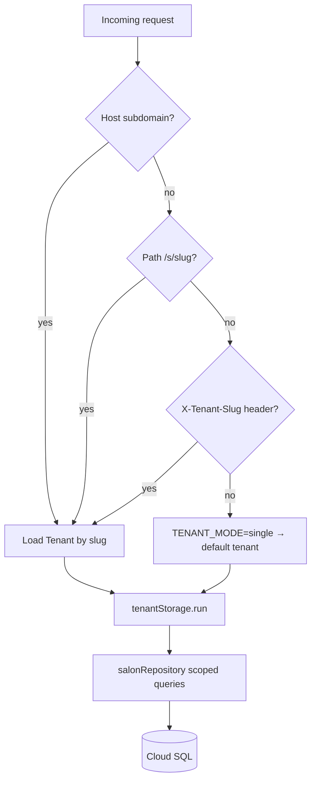

# Multi-Tenancy Architecture Plan — Hair Simo

status: **Implemented for Hair Simo** (2026-07-29). `Tenant` + `tenantId` on 29 tables
(16 roots + 13 children); composite uniques `(tenantId, email|slug|sku|code|…)`;
AsyncLocalStorage + Prisma extension; admin JWT + public `X-Tenant-Slug`/subdomain;
cron loops `forEachActiveTenant`; `Tenant.settings` overrides no-show env defaults.
Still optional: PostgreSQL RLS (phase 4 defense-in-depth).

---

## 1. Goal & scope

### Target state

| Dimension | Today | Target (SaaS-ready) |
|-----------|-------|---------------------|
| Deployments | 1 web + 1 admin per salon | 1 shared platform, N salons |
| Data isolation | Implicit (whole DB = one salon) | Explicit `tenantId` on every salon-owned row |
| Onboarding | Terraform + seed per salon | Admin provision API + tenant config |
| Billing | N/A | Out of scope for phase 1–3; schema leaves room |

### Recommended posture: **single deployment, multi-salon rows**

- One Cloud SQL instance, one Prisma schema, one set of Cloud Run services.
- Each salon is a **Tenant** row; all salon data carries `tenantId`.
- Matches the Cloud SQL cost decision (`docs/decisions.md`): AlloyDB was rejected partly
  because it is priced for a multi-tenant SaaS backend this product does not need *yet* —
  but row-level tenancy on Cloud SQL is the right scale step before DB-per-tenant.

### Single-tenant escape hatch (future path)

If a franchise or enterprise customer ever needs hard isolation:

1. **Today:** feature-flag `TENANT_MODE=single` → middleware resolves fixed default tenant
   (zero behaviour change for Hair Simo Brixen).
2. **Later:** export tenant → dedicated Cloud SQL instance (DB-per-tenant) using the same
   schema; point their subdomain at a tenant-scoped deployment or connection string.
3. **Never required** for the first ~50 four-chair salons on shared Cloud SQL.

### In scope (phases 1–4)

- `Tenant` entity, `tenantId` columns, backfill, query scoping, auth mapping, cron iteration.
- Subdomain/slug tenant resolution on public web; JWT claim on admin.
- Per-tenant config replacing global env vars (`SALON_TIME_ZONE`, no-show thresholds, domains).

### Out of scope (phase 5+)

- Stripe/billing, self-service signup, platform super-admin console, schema-per-tenant,
  Identity Platform multi-tenant project split, white-label DNS automation.

---

## 2. Data model

### 2.1 New entity: `Tenant`

```prisma
model Tenant {
  id              String    @id @default(cuid())
  slug            String    @unique          // URL-safe: "hairsimo-brixen"
  displayName     String
  legalName       String?
  timeZone        String    @default("Europe/Rome")
  defaultLocale   String    @default("it")
  currency        String    @default("EUR")
  status          TenantStatus @default(active)  // active | suspended | provisioning
  webDomain       String?                      // custom domain override
  adminDomain     String?                      // optional per-tenant admin host
  settings        Json      @default("{}")     // no-show policy, deposit %, branding
  createdAt       DateTime  @default(now()) @db.Timestamptz(3)
  updatedAt       DateTime  @updatedAt @db.Timestamptz(3)

  users           User[]
  // relations to root entities as needed for Prisma ergonomics
}

enum TenantStatus {
  provisioning
  active
  suspended
}
```

**Default tenant for migration** (created in first migration seed):

| Field | Value |
|-------|-------|
| `id` | `cltenant00000000000000001` (fixed cuid for idempotent backfill) |
| `slug` | `hairsimo-brixen` |
| `displayName` | `Hair Simo` |
| `timeZone` | `Europe/Rome` |
| `defaultLocale` | `it` |
| `status` | `active` |

All existing rows receive this `tenantId` during backfill.

### 2.2 Tables that get `tenantId` (~22 direct + children)

**Root entities — `tenantId` required, indexed, FK → `Tenant`:**

| # | Model | Notes on uniqueness change |
|---|-------|----------------------------|
| 1 | `User` | `@@unique([tenantId, email])` replaces global `@unique` on `email` |
| 2 | `StaffProfile` | Denormalized `tenantId` (matches `User.tenantId`; enforce via trigger or app) |
| 3 | `Customer` | `@@unique([tenantId, email])`, `@@unique([tenantId, phone])` (partial, where not null) |
| 4 | `Service` | `@@unique([tenantId, slug])` replaces global `slug` unique |
| 5 | `BusinessHours` | Salon-wide; today unscoped singleton rows |
| 6 | `Product` | `@@unique([tenantId, sku])` |
| 7 | `Appointment` | High-traffic; denormalized for conflict queries |
| 8 | `Payment` | Denormalized for webhook lookup without join |
| 9 | `Voucher` | `@@unique([tenantId, code])` |
| 10 | `Waitlist` | |
| 11 | `RecurringSeries` | |
| 12 | `Conversation` | |
| 13 | `CallLog` | |
| 14 | `NotificationLog` | Cron scans cross-appointment; needs direct filter |
| 15 | `AuditLog` | Compliance: must filter per tenant in admin UI |
| 16 | `DataRequest` | GDPR requests scoped to tenant's customers |

**Child entities — `tenantId` denormalized for RLS simplicity and index-only cron scans:**

| # | Model | Parent chain |
|---|-------|--------------|
| 17 | `CustomerNote` | Customer |
| 18 | `ConsentRecord` | Customer |
| 19 | `ServiceTranslation` | Service |
| 20 | `StaffService` | StaffProfile + Service |
| 21 | `StaffAvailabilityRule` | StaffProfile |
| 22 | `StaffTimeOff` | StaffProfile |
| 23 | `AppointmentStatusHistory` | Appointment |
| 24 | `Refund` | Payment |
| 25 | `BookingVerification` | Appointment |
| 26 | `ReviewRequest` | Appointment |
| 27 | `VoucherRedemption` | Voucher |
| 28 | `Message` | Conversation |

**Global / unchanged:**

| Model | Reason |
|-------|--------|
| `Role` | Three fixed keys (`owner`, `manager`, `staff`); shared catalogue |
| `UserRole` | Scoped implicitly via `User.tenantId`; optional `tenantId` column in phase 2b for RLS |

### 2.3 Index pattern (every tenant-scoped table)

```prisma
tenantId String
tenant   Tenant @relation(fields: [tenantId], references: [id])

@@index([tenantId])
@@index([tenantId, /* existing composite keys */])
```

Replace global uniques with composite `(tenantId, field)` as listed above.

### 2.4 Config migration: env → tenant settings

Today salon-specific behaviour is global env (`SALON_TIME_ZONE`, `NO_SHOW_DEPOSIT_THRESHOLD_CENTS`,
`NO_SHOW_DEPOSIT_PERCENTAGE`). Move to `Tenant.settings` JSON (typed in `packages/core`):

```typescript
type TenantSettings = {
  noShowDepositThresholdCents: number;
  noShowDepositPercentage: number;
  depositRequiredDefault: boolean;
  branding?: { logoUrl?: string; primaryColor?: string };
};
```

`packages/core/src/time.ts` gains `resolveTimeZone(tenantId | tenantSettings)` instead of
module-level `SALON_TIME_ZONE` only. Phase 1 keeps env fallback for the default tenant.

---

## 3. Migration strategy

Four phases, each deployable independently. No big-bang cutover.

```
Phase 1          Phase 2           Phase 3              Phase 4
────────         ────────          ────────             ────────
Add Tenant       Backfill all      NOT NULL +           RLS (optional
+ nullable       rows → default    composite uniques    defense-in-depth)
  tenantId       tenant            + app scoping
```

### Phase 1 — Schema additive (nullable `tenantId`)

**Goal:** Zero runtime behaviour change.

1. Add `Tenant` model + seed default tenant in migration SQL.
2. Add nullable `tenantId` column + FK (no NOT NULL yet) to all 28 tables above.
3. Add indexes on `tenantId` (concurrently where possible on production).
4. Deploy app code that **writes** `tenantId = DEFAULT_TENANT_ID` on all creates (feature-flagged
   `MULTI_TENANT_WRITES=true`); reads still unscoped until phase 3.
5. Prisma migration: `packages/db/prisma/migrations/YYYYMMDD_add_tenant_nullable/`.

**Rollback:** Drop nullable columns; `Tenant` table optional to keep.

### Phase 2 — Backfill

**Goal:** Every row has a tenant.

1. Idempotent SQL script (run in transaction batches):

```sql
UPDATE "User" SET "tenantId" = 'cltenant00000000000000001' WHERE "tenantId" IS NULL;
-- repeat for each table; verify counts match
```

2. Verification query per table: `SELECT COUNT(*) FROM "X" WHERE "tenantId" IS NULL` → 0.
3. Denormalized children: backfill from parent join, e.g.:

```sql
UPDATE "CustomerNote" cn
SET "tenantId" = c."tenantId"
FROM "Customer" c WHERE cn."customerId" = c.id AND cn."tenantId" IS NULL;
```

4. Add CI check: `scripts/verify-tenant-backfill.ts` fails if any nulls remain.

**Rollback:** Set `tenantId` back to NULL (only before phase 3).

### Phase 3 — Enforce + app scoping

1. `ALTER COLUMN "tenantId" SET NOT NULL` on all scoped tables.
2. Drop old global uniques; add composite uniques (see §2.2).
3. Enable `MULTI_TENANT_READS=true`: repository wrapper injects tenant filter (§4).
4. Admin JWT includes `tenantId`; public routes resolve tenant from slug/subdomain.
5. Integration tests: two tenants, prove no cross-read.

**Rollback:** Disable read flag; nullable revert requires downtime.

### Phase 4 — RLS (optional, recommended before 10+ tenants)

PostgreSQL row-level security as **defense in depth**, not primary isolation:

```sql
ALTER TABLE "Appointment" ENABLE ROW LEVEL SECURITY;
CREATE POLICY tenant_isolation ON "Appointment"
  USING ("tenantId" = current_setting('app.current_tenant_id', true));
```

Prisma `$executeRaw` sets `SET LOCAL app.current_tenant_id = $1` at transaction start
(via repository wrapper). See §4 tradeoffs.

---

## 4. Query scoping

### Options compared

| Approach | Pros | Cons |
|----------|------|------|
| **Prisma middleware** | Automatic on all `prisma.*` calls | Cannot intercept `$queryRaw` easily; nested writes/`connect` edge cases; opaque errors; bypass via direct `prisma` import |
| **Repository wrapper** | Matches existing `salonRepository` seam; explicit; testable; cron can loop tenants | Must touch every method; raw queries outside repo leak |
| **PostgreSQL RLS** | DB-enforced last line; survives app bugs | Prisma pool + `SET LOCAL` per request; migration complexity; superuser bypass |

### Recommendation: **repository wrapper + AsyncLocalStorage context** (primary), RLS in phase 4 (secondary)

**Why:** All business data access already flows through `packages/core/src/repositories.ts`
(`salonRepository`, ~80 methods). Services in `packages/core` import the repository, not Prisma
directly (except `auth-service.ts` — must be migrated).

**Implementation sketch:**

```typescript
// packages/db/src/tenant-context.ts
import { AsyncLocalStorage } from "node:async_hooks";

export type TenantContext = { tenantId: string; slug: string; settings: TenantSettings };

export const tenantStorage = new AsyncLocalStorage<TenantContext>();

export function requireTenant(): TenantContext {
  const ctx = tenantStorage.getStore();
  if (!ctx) throw new Error("TENANT_CONTEXT_MISSING");
  return ctx;
}

export function scopeWhere<T extends object>(where: T = {} as T): T & { tenantId: string } {
  return { ...where, tenantId: requireTenant().tenantId };
}
```

```typescript
// packages/core/src/repositories.ts — before
listServices: () => prisma.service.findMany({ where: { isActive: true } }),

// after
listServices: () => prisma.service.findMany({
  where: scopeWhere({ isActive: true }),
}),
```

**Request lifecycle:**

```
HTTP / Cron / Task
  → resolve tenant (§7)
  → tenantStorage.run({ tenantId, ... }, () => handler())
  → salonRepository.* (auto-scoped)
  → optional: prisma $transaction → SET LOCAL app.current_tenant_id (RLS)
```

**Bypass hatch:** `runAsPlatform({ tenantId }, fn)` for migrations and cross-tenant cron
inner loops — never exposed to route handlers.

**Direct Prisma calls to fix:**

| File | Usage |
|------|-------|
| `packages/core/src/auth-service.ts` | `prisma.user.findUnique` — add tenant scope |
| `apps/admin/lib/admin-api.ts` | audit + session reload |
| `packages/db/src/seed.ts` | seed per tenant |

**Blocking bounds cache** (`cachedBlockingBounds` in `repositories.ts`): key by `tenantId`,
not global singleton.

---

## 5. Auth — admin users and tenants

### Model

```
Tenant 1──* User 1──* UserRole *──1 Role (global)
         │
         └──* StaffProfile (1:1 User for bookable staff)
```

- **One user belongs to exactly one tenant** in phase 1–3 (simplest; email unique per tenant).
- **Owner:** full tenant admin; can manage staff, services, GDPR, vouchers.
- **Manager:** same except billing/settings reserved for owner (existing role matrix).
- **Staff:** read/write own appointments, customers, notes; no tenant settings.

### Login flow change

1. Client sends credentials to `POST /api/auth/login` (admin).
2. Server resolves tenant **before** user lookup:
   - Phase A: fixed default tenant (no UX change for Brixen).
   - Phase B: `admin.hairsimo.it` + `X-Tenant-Slug` header, or `{slug}.admin.hairsimo.it`.
3. `AuthService.resolveUserSession(userId)` verifies `user.tenantId === resolvedTenant.id`.
4. JWT claims gain `tenantId` + `tenantSlug`; `tokenVersion` unchanged.

```typescript
type AdminTokenClaims = {
  // existing fields…
  tenantId: string;
  tenantSlug: string;
};
```

### Identity Platform (production)

- **Phase 1–3:** Single Firebase project; custom claim `tenantId` set on login via Admin SDK
  after DB lookup (same as today + one claim).
- **Phase 5+:** Firebase Identity Platform multi-tenancy (tenant per salon) if compliance
  requires auth-level isolation — not needed initially.

### Cross-tenant staff (future)

A stylist working at two salons gets two `User` rows (different tenants, same email allowed).
Single sign-on across tenants is out of scope.

### Customer auth (unchanged pattern)

Customers are tenant-scoped rows. Appointment tokens embed `tenantId` in signed claims or
resolve tenant from the appointment row on verify (existing two-pass check in
`docs/architecture.md` §4).

---

## 6. Infrastructure

### Option comparison

| Model | Fit for Hair Simo SaaS | Verdict |
|-------|------------------------|---------|
| **Shared DB, row-level `tenantId`** | Cloud SQL already chosen; Prisma single schema; ~100s of small salons | **Recommended** |
| **Schema-per-tenant** | N migrations × N schemas; Prisma does not support well; ops burden | Reject |
| **DB-per-tenant** | Hard isolation; 10× Cloud SQL cost; Terraform loop per salon | Escape hatch only |

### Shared DB layout (recommended)

```
Cloud SQL (PostgreSQL 16, europe-west8)
└── database: hairsimo
    ├── Tenant
    ├── User (+ tenantId)
    ├── Appointment (+ tenantId)
    └── … all salon tables
```

**Connection pooling:** Existing Cloud SQL + Cloud Run private IP unchanged. One
`DATABASE_URL`; RLS uses session variable, not separate roles per tenant.

**Terraform changes (phase 3+):**

| File | Change |
|------|--------|
| `infra/terraform/variables.tf` | `web_domain` → apex + wildcard `*.hairsimo.it` SSL cert |
| `infra/terraform/resources.tf` | Load balancer host rules for `{slug}.hairsimo.it`; optional wildcard |
| `infra/terraform/resources.tf` | Cloud Scheduler: single cron hits platform; app loops tenants |
| Secret Manager | Per-tenant secrets (PSP keys, Dialogflow) → `Tenant.settings` refs or prefixed secrets |

**No second Cloud Run service** until a tenant pays for dedicated isolation (DB-per-tenant fork).

---

## 7. API changes — tenant resolution

### Resolution order (public web)

| Priority | Mechanism | Example |
|----------|-----------|---------|
| 1 | Host subdomain | `brixen.hairsimo.it/de/book` |
| 2 | Path prefix | `hairsimo.it/s/brixen/de/book` (fallback before wildcard DNS) |
| 3 | Header (API clients) | `X-Tenant-Slug: brixen` |
| 4 | Default tenant | `TENANT_MODE=single` → `hairsimo-brixen` |

Middleware: `apps/web/middleware.ts` parses host/path → loads `Tenant` by slug (cached 60s).

### Admin app

| Surface | Resolution |
|---------|------------|
| Login | `X-Tenant-Slug` or subdomain `{slug}.admin.hairsimo.it` |
| Session | JWT claim `tenantId` (authoritative after login) |
| API calls | `adminRoute` validates session `tenantId` matches context |

### Internal / machine routes

| Route | Tenant resolution |
|-------|-------------------|
| `POST /api/cron/reminders` | Loop `Tenant WHERE status = active`; `runAsPlatform` per tenant |
| `POST /api/cron/sweep` | Same |
| `POST /api/payments/webhook` | Lookup `Payment` → `tenantId` |
| `POST /api/voice/dialogflow` | Phone number → tenant mapping in `Tenant.settings` |
| `POST /api/chat/*` | Channel external ref or default tenant |
| Cloud Tasks callbacks | Payload includes `tenantId` |

### Public config

`GET /api/config/public` returns tenant-scoped branding + feature flags once multi-tenant
is live (today: global env only).

---

## 8. Effort estimate

### Phase summary

| Phase | Size | Duration (1 dev) | Deliverable |
|-------|------|------------------|-------------|
| **0 — Plan + ADR** | S | Done | This document |
| **1 — Nullable schema + write path** | M | 3–5 days | Migration, `Tenant` seed, write-side `tenantId` |
| **2 — Backfill + verify** | S | 1–2 days | SQL scripts, CI verifier, zero nulls |
| **3 — Read scoping + auth + API** | L | 2–3 weeks | Repository scoping, JWT, middleware, tests |
| **4 — RLS + cron + audit** | M | 1 week | Postgres policies, multi-tenant sweep, audit filter |
| **5 — Onboarding UI** | L | 2+ weeks | Provision tenant, DNS, self-serve (future) |

### File touch list (phases 1–4)

| Area | Files |
|------|-------|
| **Schema** | `packages/db/prisma/schema.prisma`, new migrations, `packages/db/src/seed.ts` |
| **Tenant context** | `packages/db/src/tenant-context.ts` (new), `packages/db/src/index.ts` |
| **Repository** | `packages/core/src/repositories.ts`, `repositories.test.ts` |
| **Services** | `booking-service.ts`, `payment-service.ts`, `notification-service.ts`, `gdpr-service.ts`, `waitlist-service.ts`, `voucher-service.ts`, `recurring-service.ts`, `review-request-service.ts`, `data-retention.ts`, `calendar.ts`, `time.ts` |
| **Auth** | `packages/core/src/auth-service.ts`, `apps/admin/lib/auth.ts`, `apps/admin/app/api/auth/login/route.ts` |
| **Admin API** | `apps/admin/lib/admin-api.ts`, all `apps/admin/app/api/**/route.ts` (~30 routes) |
| **Web API** | `apps/web/middleware.ts` (new/extend), `apps/web/lib/tenant.ts` (new), `apps/web/app/api/**/route.ts` (~35 routes) |
| **Cron** | `apps/web/app/api/cron/reminders/route.ts`, `apps/web/app/api/cron/sweep/route.ts` |
| **Infra** | `infra/terraform/resources.tf`, `variables.tf`, `terraform.tfvars.example` |
| **Docs** | `docs/architecture.md`, `docs/decisions.md`, `docs/operations.md`, `docs/api.md` |
| **Tests** | New `multitenancy.test.ts` suites in core + integration smoke |

---

## 9. Risks

### GDPR / cross-tenant data leakage

| Risk | Mitigation |
|------|------------|
| Missing `tenantId` filter on one query | Repository wrapper + integration tests with 2 tenants; CI grep for raw `prisma.` outside repo |
| Wrong tenant on public booking | Subdomain slug validated against `Tenant.status`; 404 on unknown slug |
| GDPR export spans tenants | `GdprService.exportCustomerData` must receive `tenantId`; customer lookup `WHERE id AND tenantId` |
| Email/phone reuse across salons | Composite unique `(tenantId, email)` — same person can exist in two tenants |
| Erasure in wrong tenant | Admin session `tenantId` + customer `tenantId` double-check before anonymise |

### Audit log

- Add `tenantId` to `AuditLog`; admin list API filters by session tenant.
- Platform support (future): separate role bypassing tenant filter — not in phase 1–4.
- Existing `redactForAudit` unchanged; ensure `before`/`after` JSON never contains other tenants' IDs.

### Cron jobs

| Job | Risk | Mitigation |
|-----|------|------------|
| Reminders | Sends salon A reminder to salon B customer | Outer loop per tenant; notification queries scoped |
| Sweep (verification) | Cancels wrong tenant's pending bookings | `expireUnverifiedBefore(tenantId, …)` |
| Waitlist expire | Not wired yet; design with tenant loop from start | |
| Recurring materialise | Double-book across tenants (low) | Scoped conflict predicate already per staff; add `tenantId` to window filter |
| Data retention | Cross-tenant purge | `dataRetentionService` parameterised by tenant |

**Cron credential leak:** Today one secret sweeps all data. Multi-tenant: same secret but
handler must iterate tenants internally — never accept `tenantId` from request body
(see existing sweep route comment on rejecting caller-supplied cutoffs).

### Performance

- Every query gains `tenantId` index predicate — negligible at salon scale.
- `readBlockingBounds` cache per tenant (max service duration differs per salon).
- Wildcard SSL + middleware tenant lookup: cache in memory / Cloud CDN not applicable; use 60s LRU.

### Migration downtime

- Phases 1–2: online, nullable columns.
- Phase 3 NOT NULL: brief lock per table; schedule off-peak; use `NOT VALID` constraints first if needed.

---

## Appendix A — Decision record (proposed)

Add to `docs/decisions.md` when phase 1 starts:

> **2026-XX-XX — Row-level multi-tenancy on shared Cloud SQL**
>
> - **Isolation:** `tenantId` on all salon-owned tables; repository wrapper as primary enforcement.
> - **Not chosen:** schema-per-tenant (Prisma ops cost), DB-per-tenant (cost until enterprise tier).
> - **Default tenant:** `cltenant00000000000000001` / `hairsimo-brixen` for zero-downtime migration.
> - **RLS:** deferred to phase 4 as defense-in-depth.

---

## Appendix B — Tenant resolution diagram


